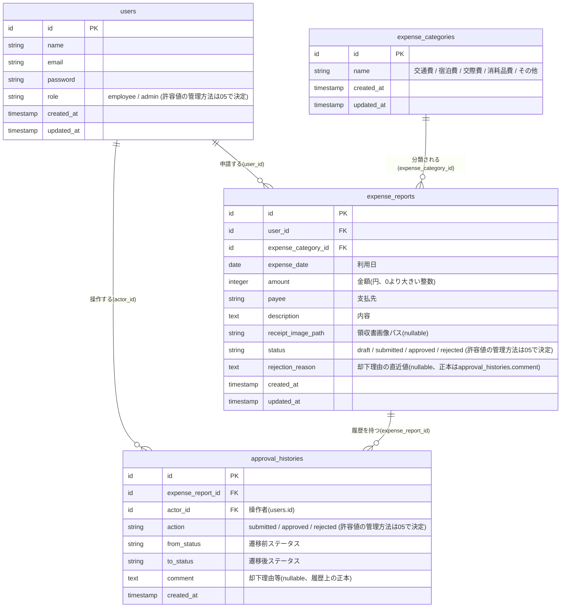
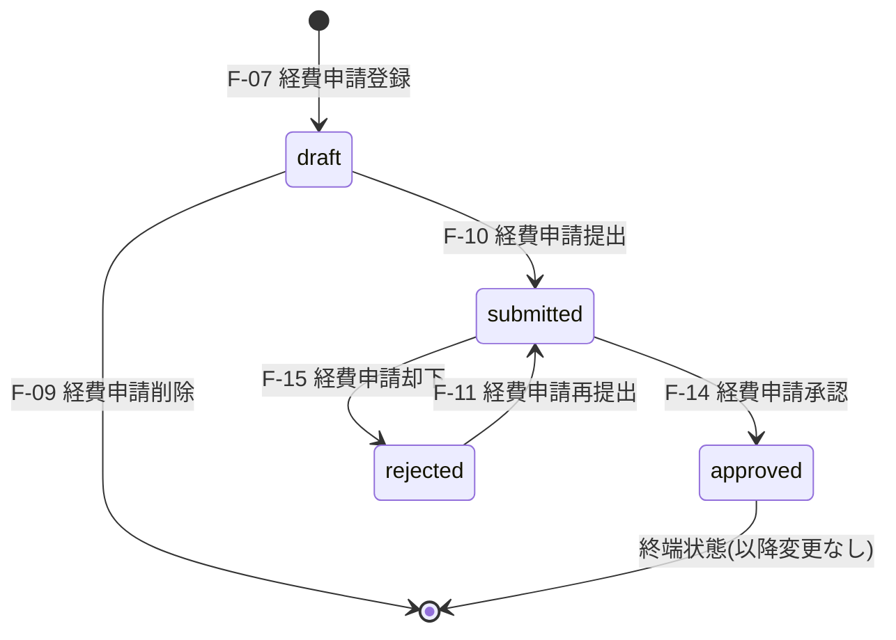

# ER図・DB設計

本ドキュメントは、`01_requirements.md`・`02_screen_list.md`・`03_function_list.md` の内容を踏まえ、経費精算アプリ(MVP)のデータベース設計をまとめたものである。

本ドキュメントでは、テーブル一覧・ER図・リレーション・ステータス遷移・テーブル採否の理由付けを扱う。カラムの型・制約(NOT NULL/UNIQUE等)・インデックス・外部キーの削除方針(ON DELETE等)といった実装レベルの詳細は `05_table_definition.md` で定義する。

## 設計方針の要点

- 「シンプルさ優先・過剰な設計を避ける」という開発原則([00_project_policy.md](00_project_policy.md) 5章)に基づき、要件から読み取れる範囲でテーブルを最小限に構成する。
- 経費申請(`expense_reports`)は1申請=1レコードであり、明細行(品目)を複数持つヘッダー/明細構造は採用しない(F-07の入力項目が単一セットであるため)。
- 領収書画像は「1申請につき任意で1枚」という要件に合わせ、独立した添付テーブルは設けず`expense_reports`に単一カラムを持たせる。
- 経費カテゴリは要件・機能一覧で明示的に「マスタ」と表現されているため、マスタテーブル(`expense_categories`)として管理する。
- 承認履歴は非機能要件上は必須ではないが、開発背景で挙げられている「承認履歴の検索・管理が煩雑」という課題認識、および実装コストの低さ(専用画面を追加せずに済む)を踏まえ、監査証跡として`approval_histories`テーブルを採用する。
- 却下理由は`approval_histories.comment`を履歴上の正本(source of truth)とし、`expense_reports.rejection_reason`は詳細画面表示用に保持する直近値のキャッシュと位置付ける。`rejection_reason`は現在状態の表示に必要な直近値のみを保持し、過去の却下理由は`approval_histories.comment`側に残る形とする。更新規則は以下の通り。
  - 却下時(F-15): `approval_histories.comment`と同じ却下理由を`rejection_reason`に設定する
  - 再提出時(F-11): `rejection_reason`をnullにクリアする
  - 過去の却下理由: `rejection_reason`では保持せず、`approval_histories.comment`に記録された各履歴行から参照する

## 1. テーブル一覧

| テーブル | 役割 |
|---|---|
| `users` | 一般社員・管理者のアカウント情報とロールを管理する |
| `expense_categories` | 経費カテゴリのマスタ(交通費・宿泊費等)を管理する |
| `expense_reports` | 経費申請本体を管理する。1申請=1レコードで、ステータス・却下理由・領収書画像パスを保持する |
| `approval_histories` | 経費申請の状態遷移(提出・承認・却下・再提出)の履歴を記録する |

候補にあった `expense_items`(明細行)・`expense_attachments`(添付ファイル別テーブル)は、要件が「1申請=1件の経費エントリ」「領収書画像は単数」であることと整合しないため採用しない。

## 2. ER図



型はLaravel Migration固有の型(unsignedInteger等)ではなく概念型(id/string/text/date/integer/timestamp)で表記している。実際のMigration型・NOT NULL/UNIQUE等の制約・インデックス・外部キーの削除方針(ON DELETE等)は `05_table_definition.md` で定義する。

## 3. テーブル概略

詳細なカラム定義(型・制約・インデックス・FK削除方針)は `05_table_definition.md` に記載する。ここでは各テーブルの役割と主要カラムのみを示す。

| テーブル | 主要カラム | 補足 |
|---|---|---|
| `users` | name, email, password, role | role: `employee`(一般社員) / `admin`(管理者) |
| `expense_categories` | name | MVPではCRUD機能を持たず、Seederで初期データ(交通費/宿泊費/交際費/消耗品費/その他)を投入する読み取り専用マスタ |
| `expense_reports` | user_id, expense_category_id, expense_date, amount, payee, description, receipt_image_path, status, rejection_reason | rejection_reasonは現在表示用の直近値(2章参照) |
| `approval_histories` | expense_report_id, actor_id, action, from_status, to_status, comment | commentは却下理由等の履歴上の正本(2章参照) |

## 4. リレーション一覧

```
users (1) ──< (N) expense_reports        [expense_reports.user_id]
expense_categories (1) ──< (N) expense_reports  [expense_reports.expense_category_id]
expense_reports (1) ──< (N) approval_histories  [approval_histories.expense_report_id]
users (1) ──< (N) approval_histories      [approval_histories.actor_id]
```

## 5. ステータス遷移



- `draft`・`rejected`状態での編集(F-08)はステータスを変更しない。
- `approved`は終端状態であり、以降いかなる機能によってもステータスは変更されない。
- `approval_histories`への追記は、ステータスを変更する操作のうちF-10(経費申請提出)・F-11(経費申請再提出)・F-14(経費申請承認)・F-15(経費申請却下)の実行時に限って行う。F-07(経費申請登録、下書き作成)は新規作成であり遷移元ステータスが存在しないため、またF-08(経費申請編集)・F-09(経費申請削除)はステータスを変更しないため、いずれも`approval_histories`への追記対象としない。
- 上記4機能(F-10/F-11/F-14/F-15)の実行時は、`expense_reports.status`の変更・`expense_reports.rejection_reason`の更新・`approval_histories`への1行追記を、同一処理単位・同一DBトランザクション内で行う。具体的な実装(サービスクラス等の構成)はcontroller設計工程で決定する。

## 6. 設計上の簡略化ポイントと要件との対応

| 簡略化ポイント | 理由・対応する要件 |
|---|---|
| 明細行(expense_items)を持たない | F-07の入力が利用日・金額・カテゴリ・支払先・内容の単一セットのみのため |
| 領収書画像は単一カラム(添付テーブルなし) | 要件・画面・機能一覧のいずれも「領収書画像」は単数表現。複数枚添付の記述なし |
| ロールを`users.role`の単一カラムで管理 | ロールは一般社員/管理者の2種で固定、動的追加の要件なし |
| 論理削除(SoftDeletes)を採用しない | 削除は下書き状態のみ(F-09)。復元・ゴミ箱機能の記載なし |
| 経費カテゴリのCRUD機能を持たない | 01_requirements.md 11章で「カテゴリマスタの登録・編集・削除機能はMVP対象外」と明記 |

## 7. 残る懸念点・確認事項

- `expense_reports.rejection_reason`(現在表示用の直近値)と`approval_histories.comment`(履歴上の正本)は二重管理になる。5章の通り、ステータス変更と同一トランザクション内で両方を更新することで不整合を防ぐ方針とし、具体的なクラス構成はcontroller設計工程で決定する。
- `approval_histories.action`は再提出も`submitted`として記録するため、履歴表示を行う場合は`from_status`を見て「提出」と「再提出」を区別する実装が必要になる(現時点で履歴表示画面はMVP対象外)。
- `users.role`・`expense_reports.status`・`approval_histories.action/from_status/to_status`をDBの`ENUM`型にするか、`string`カラム+アプリ側バリデーション(PHP Enumクラス等)にするかは、`05_table_definition.md`で決定する。
- `approval_histories`は追記型ログとして`created_at`のみを持つ設計としているが、LaravelのMigration標準(`$table->timestamps()`)は`created_at`と`updated_at`を対で生成する。`updated_at`を持たない設計を実装する場合、`$table->timestamp('created_at')`を個別に定義した上で、Eloquentモデル側は`const UPDATED_AT = null;`として`updated_at`の自動更新のみを無効化し、`created_at`の自動設定(作成時のタイムスタンプ付与)は活かす案を第一候補とする。`public $timestamps = false;`は`created_at`の自動設定も無効化してしまうため採用しない。
